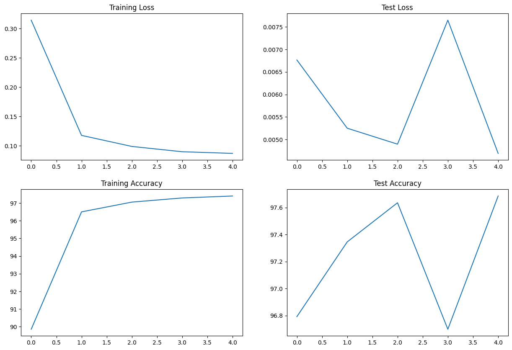

# ERA Session 4 - CNN MNIST Training

This notebook demonstrates a basic CNN implemented in PyTorch for the MNIST dataset. The workflow includes data transformation, visualization, model definition, training, and evaluation. Below you’ll find the sample outputs and plots generated by the notebook.

---

## Environment Setup

- **CUDA Available?**  
  ```
  CUDA Available? False
  ```

---

## Model Summary

```
----------------------------------------------------------------
        Layer (type)               Output Shape         Param #
================================================================
            Conv2d-1            [-1, 8, 26, 26]              80
            Conv2d-2           [-1, 16, 24, 24]           1,168
            Conv2d-3           [-1, 64, 10, 10]           9,280
            Conv2d-4             [-1, 16, 8, 8]           9,232
            Conv2d-5              [-1, 8, 2, 2]           1,160
            Linear-6                   [-1, 64]           2,112
            Linear-7                   [-1, 10]             650
================================================================
Total params: 23,682
Trainable params: 23,682
Non-trainable params: 0
----------------------------------------------------------------
Input size (MB): 0.00
Forward/backward pass size (MB): 0.17
Params size (MB): 0.09
Estimated Total Size (MB): 0.26
----------------------------------------------------------------
```

---

## Training Output

```
Epoch 1
Train: Loss=0.0715 Batch_id=3749 Accuracy=89.86: 100%|██████████| 3750/3750 [01:43<00:00, 36.22it/s]
Test set: Average loss: 0.0068, Accuracy: 58075/60000 (96.79%)

Epoch 2
Train: Loss=0.1355 Batch_id=3749 Accuracy=96.50: 100%|██████████| 3750/3750 [01:37<00:00, 38.29it/s]
Test set: Average loss: 0.0053, Accuracy: 58407/60000 (97.34%)

Epoch 3
Train: Loss=0.0026 Batch_id=3749 Accuracy=97.06: 100%|██████████| 3750/3750 [01:39<00:00, 37.71it/s]
Test set: Average loss: 0.0049, Accuracy: 58581/60000 (97.64%)

Epoch 4
Train: Loss=0.1896 Batch_id=3749 Accuracy=97.29: 100%|██████████| 3750/3750 [01:44<00:00, 35.96it/s]
Test set: Average loss: 0.0076, Accuracy: 58019/60000 (96.70%)

Epoch 5
Train: Loss=0.0007 Batch_id=3749 Accuracy=97.40: 100%|██████████| 3750/3750 [01:37<00:00, 38.45it/s]
Test set: Average loss: 0.0047, Accuracy: 58611/60000 (97.69%)
```

---

## Example Batch Visualization


_(Replace with the actual output image from your notebook)_

---

## Training & Test Metrics Plots



_(Replace with the actual output image from your notebook)_

- **Top Left:** Training Loss  
- **Top Right:** Test Loss  
- **Bottom Left:** Training Accuracy  
- **Bottom Right:** Test Accuracy  

---

## Instructions

To reproduce the results:
- Install required libraries: `torch`, `torchvision`, `torchsummary`, `matplotlib`, `tqdm`
- Run the notebook `ERA_Session_4.ipynb` step by step

---

## References

- [PyTorch Documentation](https://pytorch.org/)
- [MNIST Dataset](http://yann.lecun.com/exdb/mnist/)
