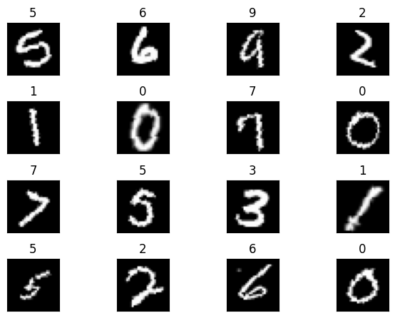

# EVA4 Session 2 – CNN on MNIST  

## 📌 Overview  
This notebook implements a **Convolutional Neural Network (CNN)** for the MNIST digit classification task. The goal is to explore different convolutional and pooling layers, understand receptive fields, and optimize the architecture for accuracy and efficiency.  

---

## 🔄 Process  
1. **Data Preparation**
   - Dataset: **MNIST** handwritten digits (28×28 grayscale).
   - Normalization and standard transformations applied.  
   - Data loaders prepared with batching and shuffling.

2. **Model Design**
   - Experimented with **3×3 convolutions**, **1×1 convolutions**, **max pooling**, **batch normalization**, and **dropout**.  
   - Used max pooling to both increase receptive field and reduce dimensionality.  
   - Applied 1×1 convolutions for feature mixing and controlling channel depth.  

3. **Training**
   - Loss function: **Negative Log Likelihood Loss (NLLLoss)**.  
   - Optimizer: **Stochastic Gradient Descent (SGD)** with momentum.  
   - Device: CUDA/GPU if available.  
   - Training loop tracks **losses** and **accuracy** for both training and test sets.  

---
---

## Example Batch Visualization



---

## 🧠 Model Architecture  
The final CNN (`Net` class) consists of:  

- **Conv1**: 1 → 8 channels, 3×3 kernel, padding=1  
- **Conv2**: 8 → 8 channels, 3×3 kernel, padding=1  
- **MaxPool (2×2)**  
- **BatchNorm2d (8)**  
- **Conv3**: 8 → 16 channels, 3×3 kernel, padding=1  
- **Conv4**: 16 → 16 channels, 3×3 kernel  
- **MaxPool (2×2)**  
- **BatchNorm2d (16)**  
- **Dropout (0.1)**  
- **Conv5**: 16 → 32 channels, 3×3 kernel  
- **Conv6**: 32 → 32 channels, 3×3 kernel  
- **BatchNorm2d (32)**  
- **Fully Connected**: Linear(128 → 10)  
- **Output**: LogSoftmax  

---

## 📊 Model Parameters
----------------------------------------------------------------

        Layer (type)               Output Shape         Param #
        
================================================================

            Conv2d-1            [-1, 8, 28, 28]              80
            
            Conv2d-2            [-1, 8, 28, 28]             584
            
         MaxPool2d-3            [-1, 8, 14, 14]               0
         
       BatchNorm2d-4            [-1, 8, 14, 14]              16
       
           Dropout-5            [-1, 8, 14, 14]               0
           
            Conv2d-6           [-1, 16, 14, 14]           1,168
            
            Conv2d-7           [-1, 16, 12, 12]           2,320
            
         MaxPool2d-8             [-1, 16, 6, 6]               0
         
       BatchNorm2d-9             [-1, 16, 6, 6]              32
       
          Dropout-10             [-1, 16, 6, 6]               0
          
           Conv2d-11             [-1, 32, 4, 4]           4,640
           
           Conv2d-12             [-1, 32, 2, 2]           9,248
           
           Linear-13                   [-1, 10]           1,290
           
================================================================

Total params: 19,378

Trainable params: 19,378

Non-trainable params: 0

----------------------------------------------------------------


---

## 📉 Test Losses

Epoch:  1

loss=0.0634193941950798, Accuracy: 54595/60000 batch_id=468: 100%|██████████| 469/469 [00:24<00:00, 19.48it/s]

Test set: Average loss: 0.0559, Accuracy: 9821/10000 (98.21%)

Epoch:  2

loss=0.1045989990234375, Accuracy: 58460/60000 batch_id=468: 100%|██████████| 469/469 [00:23<00:00, 20.08it/s]

Test set: Average loss: 0.0336, Accuracy: 9895/10000 (98.95%)

Epoch:  3

loss=0.059799596667289734, Accuracy: 58805/60000 batch_id=468: 100%|██████████| 469/469 [00:22<00:00, 20.45it/s]

Test set: Average loss: 0.0310, Accuracy: 9903/10000 (99.03%)

Epoch:  4

loss=0.02303193509578705, Accuracy: 59000/60000 batch_id=468: 100%|██████████| 469/469 [00:22<00:00, 20.59it/s]

Test set: Average loss: 0.0313, Accuracy: 9904/10000 (99.04%)

Epoch:  5

loss=0.03736606240272522, Accuracy: 59099/60000 batch_id=468: 100%|██████████| 469/469 [00:25<00:00, 18.21it/s]

Test set: Average loss: 0.0296, Accuracy: 9915/10000 (99.15%)

Epoch:  6

loss=0.034421585500240326, Accuracy: 59114/60000 batch_id=468: 100%|██████████| 469/469 [00:23<00:00, 19.73it/s]

Test set: Average loss: 0.0226, Accuracy: 9928/10000 (99.28%)

Epoch:  7

loss=0.05157195031642914, Accuracy: 59220/60000 batch_id=468: 100%|██████████| 469/469 [00:22<00:00, 20.41it/s]

Test set: Average loss: 0.0250, Accuracy: 9919/10000 (99.19%)

Epoch:  8

loss=0.06061778590083122, Accuracy: 59231/60000 batch_id=468: 100%|██████████| 469/469 [00:23<00:00, 19.80it/s]

Test set: Average loss: 0.0195, Accuracy: 9940/10000 (99.40%)

Epoch:  9

loss=0.040781375020742416, Accuracy: 59262/60000 batch_id=468: 100%|██████████| 469/469 [00:23<00:00, 20.09it/s]

Test set: Average loss: 0.0187, Accuracy: 9944/10000 (99.44%)


---

## 🚀 How to Run  
1. Clone repo / open in Google Colab.  
2. Install dependencies:
   ```bash
   pip install torch torchvision torchsummary
3. Run the notebook cells sequentially.
4. Training progress and metrics will be logged.
   
